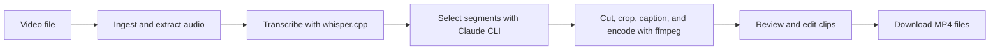

# Video Transcription and Rendering Pipeline

This project turns a long video into shorter, captioned clips. It extracts and transcribes audio, selects useful moments from the transcript, and renders each moment in three aspect ratios. A local web interface supports upload, crop preview, progress tracking, clip editing, and download. The same processing stages are available through a CLI.

Video files, transcripts, edits, and rendered clips are stored on your machine. **Clip selection sends transcript text to Claude** through the local `claude -p` command; it does not send the source video. The application tracks jobs in files rather than a database.

## Pipeline



| Step | Process | Output |
| --- | --- | --- |
| Ingest | Store the video in a job directory. Web uploads create a new job per upload; the CLI derives a stable job ID from the file hash. | `source.<ext>`, `job.json` |
| Transcribe | ffmpeg extracts 16 kHz mono WAV audio. whisper.cpp produces timestamped segments and word timings. A silence check filters known hallucinated phrases in silent regions. | `audio.wav`, `transcript.json` |
| Select | Numbered transcript segments go to `claude -p`. The returned segment ranges become timestamps and are filtered for short or overlapping clips. The result is cached by transcript hash within the job. | `clips.json` |
| Render | ffmpeg cuts each clip, applies per-ratio crop and scale, composites captions, normalizes audio, and encodes MP4 files. | `clips/render.json`, `clips/clipNN/*.mp4` |
| Edit | The web editor saves trim, framing, caption, and audio choices, then queues re-renders for the selected ratios. An optional face detector can suggest 9:16 framing. | `clips/clipNN/edit.json`, updated MP4 files |

Each selected moment renders at **1080 × 1920 (9:16)**, **1080 × 1080 (1:1)**, and **1920 × 1080 (16:9)**. Captions can be phrase overlays, word-highlighted karaoke captions, or disabled. The standard caption paths generate PNGs with Pillow and composite them with ffmpeg. An optional Hyperframes path can produce animated overlays; if it fails, rendering falls back to PNG captions.

## Tech stack and architecture

| Layer | Technology | Role |
| --- | --- | --- |
| Application | Python 3.11+, FastAPI, Uvicorn | Local HTTP server and job API |
| CLI | Typer | `ingest`, `select`, `render`, and `serve` commands |
| Web UI | Jinja2 templates, plain JavaScript and CSS | Upload, crop preview, progress, library, and editor |
| Transcription | ffmpeg, whisper.cpp | Audio extraction and local speech-to-text |
| Selection | Claude Code CLI (`claude -p`), Pydantic | Transcript-based clip choices and validation |
| Rendering | ffmpeg, Pillow | Video, audio, thumbnails, and captions |
| Optional animation | Node.js, Hyperframes, headless Chrome | Animated caption overlays |
| Optional vision | OpenCV YuNet | Local face-aware 9:16 crop suggestions |
| Verification | pytest, Playwright, Ruff | Unit, HTTP, browser, and lint checks |

The FastAPI app and Typer CLI call the same pipeline modules. In the web flow, a background thread runs the pipeline after the user starts a staged upload. The browser polls the job API for progress and completed clips. Job state is stored in JSON files; there is no database or separate job queue. A semaphore limits concurrent renders to one by default.

| Module | Responsibility |
| --- | --- |
| [`config.py`](content_machine/config.py) | Paths, tool discovery, environment overrides, defaults |
| [`jobs.py`](content_machine/jobs.py) | Job IDs, directories, stage manifests, atomic JSON writes |
| [`transcribe.py`](content_machine/transcribe.py) | Audio extraction, whisper.cpp, transcript parsing, silence filtering |
| [`select.py`](content_machine/select.py) | Claude prompt and response, clip validation, selection cache |
| [`render.py`](content_machine/render.py) | Crop math, ffmpeg commands, clip rendering, re-rendering |
| [`captions.py`](content_machine/captions.py) | Caption events, PNGs, optional Hyperframes composition |
| [`hwaccel.py`](content_machine/hwaccel.py) | Hardware encoder probe and CPU fallback |
| [`vision.py`](content_machine/vision.py) | Sample clip frames, detect faces, and suggest a static 9:16 crop |
| [`app.py`](content_machine/app.py) | Web routes, background work, job and editor APIs |
| [`cli.py`](content_machine/cli.py) | Command-line entry point |
| [`templates/`](content_machine/templates/) and [`crop.js`](content_machine/static/crop.js) | Web pages and crop preview math |

## Set up and run

You need Python **3.11 or newer** and a working Claude Code CLI login (`claude login`) for clip selection. The setup scripts install Python dependencies and prepare ffmpeg, whisper.cpp, the default `base.en` transcription model, and the optional YuNet crop model.

### Windows

```powershell
powershell -ExecutionPolicy Bypass -File scripts\setup.ps1
.venv\Scripts\python.exe -m content_machine.cli serve
```

The Windows script downloads ffmpeg/ffprobe and a prebuilt whisper.cpp binary into the gitignored `vendor/` directory.

### macOS (Apple Silicon)

The macOS script uses Homebrew for ffmpeg and cmake, then builds whisper.cpp with Metal support.

```bash
bash scripts/setup.sh
source .venv/bin/activate
content-machine serve
```

Open `http://127.0.0.1:8000` after starting the server. The project name is **Video Transcription and Rendering Pipeline**; the installed command remains `content-machine` and the Python import remains `content_machine` for compatibility. You can also invoke the CLI as `python -m content_machine.cli` from an environment with the project dependencies installed.

### Web workflow

1. Upload a video. The app creates a job and shows the source preview; processing has not started yet.
2. Set zoom and position for each ratio, choose the transcription model, maximum clip count, and caption mode, then start the job.
3. Follow progress and the job log. Rendered clips appear as they finish.
4. Edit trim points, crop, caption text or timing, and audio. Re-render the changed ratios and download the MP4 files.

In the clip editor, **Suggest 9:16 face crop** samples up to 12 frames from the current trim window and runs OpenCV's YuNet face detector locally to propose one static crop. The suggestion appears in the existing preview as an unsaved edit; check it before choosing **Apply & re-render**. The result is cached in `face_suggestion.json` for that trim window. If no clear face is found, manual framing remains available. On an existing installation, install `pip install -e ".[vision]"` and run `python scripts/setup_vision.py` to enable the detector; the setup scripts do both for new installations. The model file stays in gitignored `vendor/models/`.

### CLI workflow

```bash
content-machine ingest path/to/video.mp4
content-machine select <job_id>
content-machine render <job_id>
```

`ingest` prints the job ID for the next commands. Run `content-machine --help` or a subcommand's `--help` for options. CLI ingest can reuse a transcript for the same file unless `--force` is supplied. Each web upload starts a separate job, even if its video bytes match an earlier upload.

## Job storage and progress

```text
data/<job_id>/
├── job.json                 # stage status and run metadata
├── source.<ext>             # source video
├── audio.wav                # 16 kHz mono extraction
├── transcript.json          # timestamped segments and words
├── clips.json               # selected ranges and transcript hash
└── clips/
    ├── render.json          # rendered clip index and output paths
    └── clip01/
        ├── 9x16.mp4
        ├── 1x1.mp4
        ├── 16x9.mp4
        ├── thumb.jpg
        ├── face_suggestion.json  # created after a successful face analysis
        └── edit.json        # created after an edit
```

`job.json` tracks `ingest`, `transcribe`, `select`, and `render`. The UI reads those files through FastAPI endpoints. Transcript and selection outputs can be reused within a job; an interrupted web background worker does not automatically restart when the server launches again. Logs go to `logs/content_machine.log` and `logs/jobs/<job_id>.log`.

`data/`, `vendor/`, local virtual environments, and runtime logs are excluded from Git.

## Configuration

ffmpeg, ffprobe, and Claude resolve from an environment override, the system `PATH`, or a vendored binary. whisper.cpp resolves from its configured or vendored location. Useful overrides are:

| Variable | Purpose |
| --- | --- |
| `CM_DATA_DIR` | Job storage directory; default is project `data/` |
| `CM_WHISPER_DIR`, `CM_WHISPER_CLI`, `CM_WHISPER_MODEL` | whisper.cpp location, executable, and model; default model is `base.en` |
| `CM_FFMPEG`, `CM_FFPROBE`, `CM_CLAUDE` | External executable paths |
| `CM_MAX_RENDERS` | Maximum simultaneous render jobs; default is `1` |
| `CM_ENCODER`, `CM_FORCE_CPU` | Encoder preference or forced CPU encoding |
| `CM_FACE_MODEL` | Optional path to a compatible YuNet ONNX face detector model |

The renderer probes H.264 hardware encoding. On supported systems it uses NVENC or VideoToolbox; if GPU encoding fails, it retries with `libx264`. Decode and video filters remain on the CPU. See [`BENCHMARKS.md`](BENCHMARKS.md) for measurements and benchmark instructions.

## Development checks

Install development dependencies in the virtual environment with `python -m pip install -e ".[dev]"`. The CI workflow runs Ruff and the unit/HTTP tests, with a separate Playwright browser job.

```bash
ruff check content_machine tests
pytest -m "not e2e and not slow"
python -m playwright install chromium
pytest -m "e2e and not slow"
```

The Playwright suite needs ffmpeg and browser dependencies. The real-render test marked `slow` is excluded above. See [CI](.github/workflows/test.yml) and [`tests/`](tests/) for the checks. The `Makefile` has shortcuts on macOS/Linux; on Windows, run the commands from `.venv\Scripts\` or use `.venv\Scripts\python.exe -m ...`.

## Current boundaries

- Selection depends on a Claude Code CLI login and sends transcript text to Claude. There is no separate API-key selection backend.
- The optional face suggestion creates one static 9:16 crop. It does not track a moving speaker or identify which of several visible people is speaking; review the result in the editor.
- The web server is built for one local user. Background workers live in the server process, while job files persist on disk.
- Animated Hyperframes captions require optional Node.js 22 or newer and headless Chrome. Install the local package with `npm ci --prefix tools/hyperframes` if you use that mode. The default PNG caption modes do not need it.
